# Dynamic Pricing Strategies ML - Technical Documentation

## Table of Contents

1. [Overview](#overview)
2. [System Architecture](#system-architecture)
3. [Data Generation Module](#data-generation-module)
4. [Pricing Algorithms](#pricing-algorithms)
5. [Machine Learning Components](#machine-learning-components)
6. [API Reference](#api-reference)
7. [Flow Diagrams](#flow-diagrams)
8. [Technical Glossary](#technical-glossary)
9. [Configuration Parameters](#configuration-parameters)
10. [Usage Examples](#usage-examples)

---

## Overview

The Dynamic Pricing Strategies ML project is an educational framework that demonstrates various pricing optimization techniques using machine learning and rule-based approaches. The system simulates an e-commerce marketplace ("Elves' Marketplace") with synthetic transaction data and implements multiple pricing strategies.

### Target Audience
- **Primary**: Data scientists and ML engineers
- **Secondary**: Business analysts and pricing strategists
- **Tertiary**: Software developers implementing pricing systems

### System Requirements
- Python 3.8+
- Required packages: pandas, numpy, scikit-learn, matplotlib, seaborn, plotly, jupyter, ipywidgets
- Memory: Minimum 2GB RAM for dataset processing
- Storage: 50MB for generated datasets

---

## System Architecture

The system consists of three main components:

```
┌─────────────────────────────────────────────────────────────┐
│                    Dynamic Pricing System                   │
├─────────────────────────────────────────────────────────────┤
│                                                             │
│  ┌─────────────────┐  ┌─────────────────┐  ┌─────────────────┐ │
│  │   Data Layer    │  │ Algorithm Layer │  │ Interface Layer │ │
│  │                 │  │                 │  │                 │ │
│  │ • Data Generator│  │ • Rule-based    │  │ • Jupyter       │ │
│  │ • CSV Storage   │  │ • ML Models     │  │ • Interactive   │ │
│  │ • Validation    │  │ • Optimization  │  │ • Widgets       │ │
│  └─────────────────┘  └─────────────────┘  └─────────────────┘ │
│                                                             │
└─────────────────────────────────────────────────────────────┘
```

### Data Flow Architecture

```
Raw Parameters → Data Generation → Feature Engineering → Algorithm Processing → Price Output
      ↓                ↓                    ↓                    ↓               ↓
   Business Rules → Synthetic Data → ML Features → Price Calculation → Validation
```

---

## Data Generation Module

### File: `generate_dataset.py`

This module creates synthetic e-commerce transaction data that mirrors real-world pricing scenarios.

#### Core Function: `generate_elves_marketplace_data()`

**Purpose**: Generates a realistic dataset of e-commerce transactions with dynamic pricing factors.

**Parameters**: None (configuration is internal)

**Returns**: `pandas.DataFrame` with transaction data

**Side Effects**: 
- Uses fixed random seed (42) for reproducibility
- Creates deterministic but realistic data patterns

**Configuration Parameters**:
```python
n_transactions = 25000    # Total number of transactions
n_products = 35          # Number of unique products  
start_date = 2023-01-01  # Dataset start date
end_date = 2023-12-31    # Dataset end date
```

**Data Schema**:
| Column | Type | Description | Range/Values |
|--------|------|-------------|--------------|
| transaction_id | string | Unique transaction identifier | TXN_XXXXXX |
| product_id | string | Product identifier | ELF_XXX |
| product_name | string | Human-readable product name | Various |
| category | string | Product category | Potions, Tools, Jewelry, Scrolls, Enchanted Items |
| original_price | float | Base product price | 10.0 - 500.0 |
| price_paid | float | Final transaction price | Calculated |
| quantity | int | Items purchased | 1-3 |
| timestamp | datetime | Transaction timestamp | 2023-01-01 to 2023-12-31 |
| customer_id | string | Customer identifier | CUST_XXXX |
| customer_segment | string | Customer category | New, Loyal, High-Value, Regular |
| inventory_level_before_sale | int | Stock level | 0-100 |
| competitor_price_avg | float | Market price comparison | Calculated |
| holiday_season | int | Holiday indicator | 0 or 1 |

#### Dynamic Pricing Factors

The data generation implements several pricing multipliers:

1. **Holiday Multiplier**: 1.10 - 1.30x during holiday periods
2. **Weekend Multiplier**: 1.05 - 1.15x on weekends  
3. **Inventory Multiplier**: 
   - Low stock (< 10): 1.15 - 1.25x
   - High stock (> 80): 0.90 - 0.95x
4. **Market Noise**: 0.95 - 1.05x random variation

**Algorithm**:
```python
final_price = original_price × holiday_multiplier × weekend_multiplier × inventory_multiplier × market_noise
```

#### Product Categories and Pricing

| Category | Base Price Range | Characteristics |
|----------|------------------|-----------------|
| Potions | $15 - $45 | Fast-moving consumer goods |
| Tools | $25 - $80 | Durable goods with moderate demand |
| Jewelry | $50 - $200 | Premium items with price elasticity |
| Scrolls | $10 - $30 | Low-cost, high-volume items |
| Enchanted Items | $100 - $500 | Luxury goods with low volume |

---

## Pricing Algorithms

### Rule-Based Pricing Algorithm

#### Function: `rule_based_pricing()`

**Purpose**: Applies business rule-based price adjustments using conditional logic.

**Signature**:
```python
def rule_based_pricing(original_price: float, 
                      inventory_level: int, 
                      is_holiday: bool, 
                      is_weekend: bool, 
                      customer_segment: str) -> Tuple[float, List[str]]
```

**Parameters**:
- `original_price` (float): Base price before adjustments (required, > 0)
- `inventory_level` (int): Current stock quantity (required, 0-100)
- `is_holiday` (bool): Holiday period indicator (required)
- `is_weekend` (bool): Weekend timing indicator (required)  
- `customer_segment` (str): Customer category (required, values: 'New', 'Regular', 'Loyal', 'High-Value')

**Returns**:
- `Tuple[float, List[str]]`: (adjusted_price, list_of_applied_adjustments)

**Side Effects**: None (pure function)

**Business Rules**:

1. **Inventory-Based Pricing**:
   ```python
   if inventory_level < 10:
       price *= 1.25  # +25% for scarcity
   elif inventory_level > 80:
       price *= 0.95  # -5% for excess inventory
   ```

2. **Temporal Pricing**:
   ```python
   if is_holiday:
       price *= 1.20  # +20% holiday premium
   if is_weekend:
       price *= 1.10  # +10% weekend premium
   ```

3. **Customer Segmentation**:
   ```python
   if customer_segment == 'Loyal':
       price *= 0.90  # -10% loyalty discount
   ```

**Algorithm Complexity**: O(1) - constant time execution

**Example Usage**:
```python
new_price, adjustments = rule_based_pricing(
    original_price=50.0,
    inventory_level=5,
    is_holiday=True,
    is_weekend=False,
    customer_segment='Loyal'
)
# Result: (67.50, ['📦 Low stock (+25%)', '🎄 Holiday season (+20%)', '👑 Loyal customer (-10%)'])
```

### Machine Learning Pricing Model

#### Function: `predict_optimal_price()`

**Purpose**: Uses linear regression to predict optimal pricing based on historical patterns.

**Signature**:
```python
def predict_optimal_price(original_price: float,
                         inventory_level: int,
                         is_holiday: bool,
                         is_weekend: bool,
                         competitor_price: float) -> Dict[str, Any]
```

**Parameters**:
- `original_price` (float): Base product price (required, > 0)
- `inventory_level` (int): Current inventory level (required, 0-100)
- `is_holiday` (bool): Holiday season indicator (required)
- `is_weekend` (bool): Weekend indicator (required)
- `competitor_price` (float): Average competitor pricing (required, > 0)

**Returns**:
- `Dict[str, Any]`: Comprehensive prediction results including:
  - `predicted_price`: Optimal price prediction
  - `confidence_score`: Model confidence (R² score)
  - `revenue_estimate`: Expected revenue
  - `demand_forecast`: Predicted demand
  - `price_sensitivity`: Elasticity coefficient
  - `test_prices`: Array of test prices for analysis
  - `revenues`: Corresponding revenue predictions

**Machine Learning Model**:
- **Algorithm**: Linear Regression (sklearn.linear_model.LinearRegression)
- **Features**: [original_price, inventory_level, is_holiday, is_weekend, competitor_price]
- **Target**: price_paid (from historical data)
- **Training Split**: 80% training, 20% validation
- **Performance Metrics**: R² score, RMSE

**Feature Engineering**:
```python
features = df[['original_price', 'inventory_level_before_sale', 
               'holiday_season', 'weekend', 'competitor_price_avg']]
target = df['price_paid']
```

**Model Training Process**:
1. Load historical transaction data
2. Engineer weekend feature from timestamp
3. Split data into training/validation sets
4. Fit linear regression model
5. Calculate performance metrics
6. Generate price-revenue optimization curve

---

## Machine Learning Components

### Linear Regression Price Model

The system implements a scikit-learn based linear regression model for price optimization:

**Model Architecture**:
```
Input Features (5) → Linear Regression → Price Prediction
                  ↓
              Model Coefficients → Business Insights
```

**Feature Importance**:
The model learns coefficients for each input feature, allowing interpretation of pricing factors:

```python
# Example coefficient interpretation
price_effect = {
    'base_price': 0.85,      # Strong positive correlation
    'inventory': -0.12,      # Negative correlation (more stock = lower price)
    'holiday': 8.45,         # Significant positive impact
    'weekend': 3.22,         # Moderate positive impact  
    'competitor': 0.18       # Slight positive correlation
}
```

### Revenue Optimization

The system generates revenue optimization curves by:

1. **Price Testing**: Testing price points from 80% to 120% of original price
2. **Demand Modeling**: Using price elasticity assumptions
3. **Revenue Calculation**: Revenue = Price × Predicted_Demand
4. **Optimization**: Finding price point that maximizes revenue

**Demand Elasticity Model**:
```python
# Simple elasticity assumption
demand = base_demand * (original_price / test_price) ** elasticity_coefficient
revenue = test_price * demand
```

---

## API Reference

### Core Functions

#### `generate_elves_marketplace_data()`
```python
def generate_elves_marketplace_data() -> pd.DataFrame
```
Generates synthetic e-commerce dataset with realistic pricing patterns.

**Returns**: DataFrame with 25,000 transactions across 34 products

---

#### `rule_based_pricing()`
```python
def rule_based_pricing(original_price: float, 
                      inventory_level: int, 
                      is_holiday: bool, 
                      is_weekend: bool, 
                      customer_segment: str) -> Tuple[float, List[str]]
```
Applies business rule-based price adjustments.

**Error Handling**:
- Validates price > 0
- Ensures inventory_level in valid range
- Validates customer_segment values

---

#### `predict_optimal_price()`
```python
def predict_optimal_price(original_price: float,
                         inventory_level: int,
                         is_holiday: bool,
                         is_weekend: bool,
                         competitor_price: float) -> Dict[str, Any]
```
Machine learning-based price optimization with revenue forecasting.

**Performance**: 
- Training time: ~50ms on 25k records
- Prediction time: <1ms per request
- Memory usage: ~15MB for model storage

---

### Interactive Components

#### `interactive_pricing()`
```python
def interactive_pricing(original_price: float, 
                       inventory: int, 
                       is_holiday: bool, 
                       is_weekend: bool, 
                       customer_segment: str) -> None
```
Widget-compatible function for Jupyter notebook interaction.

**Side Effects**: Prints formatted pricing analysis to stdout

---

#### `create_pricing_visualization()`
```python
def create_pricing_visualization(original_price: float = 50.0,
                                inventory_level: int = 50,
                                is_holiday: bool = False,
                                is_weekend: bool = False,
                                competitor_price: float = 52.0) -> None
```
Generates interactive Plotly visualizations for pricing analysis.

**Visualizations Created**:
- Revenue vs Price curve
- Demand vs Price relationship
- Profit margin analysis
- Competitive positioning

---

## Flow Diagrams

### Overall System Data Flow


### Rule-Based Pricing Decision Flow


### Machine Learning Model Training Flow

```mermaid
graph TD
    A[Historical Transaction Data] --> B[Data Preprocessing]
    B --> C[Feature Engineering]
    C --> D[Train/Test Split]
    D --> E[Model Training]
    E --> F[Model Validation]
    F --> G[Performance Evaluation]
    G -->|R² < 0.7| H[Hyperparameter Tuning]
    G -->|R² ≥ 0.7| I[Model Deployment]
    H --> E
    I --> J[Price Prediction Service]
    J --> K[Revenue Optimization]
```



### Price Optimization Process


---

## Technical Glossary

### Core Concepts

**Dynamic Pricing**: Algorithmic pricing strategy that adjusts prices in real-time based on market conditions, demand patterns, and business constraints.

**Price Elasticity**: Measure of how responsive demand is to price changes. Calculated as % change in demand / % change in price.

**Revenue Optimization**: Process of finding the price point that maximizes total revenue (price × quantity sold).

**Customer Segmentation**: Division of customers into groups based on behavior, value, or demographics for targeted pricing strategies.

### Algorithm Terms

**Linear Regression**: Statistical method for modeling the relationship between input features and target variable using linear equations.

**Feature Engineering**: Process of selecting and transforming variables for machine learning models.

**Cross-Validation**: Technique for evaluating model performance by testing on multiple data subsets.

**R² Score (Coefficient of Determination)**: Metric measuring how well the model explains variance in the target variable (0-1 scale).

### Business Terms

**Base Price**: Original manufacturer suggested retail price before any dynamic adjustments.

**Markup**: Percentage increase above base price.

**Markdown**: Percentage decrease below base price.

**Holiday Premium**: Additional price increase during high-demand seasonal periods.

**Inventory Multiplier**: Price adjustment factor based on current stock levels.

**Competitor Price**: Average market price for equivalent products.

### Technical Infrastructure

**Synthetic Data**: Artificially generated data that mimics real-world patterns and distributions.

**Jupyter Notebook**: Interactive computing environment for data science and ML development.

**IPython Widgets**: Interactive HTML widgets for Jupyter notebooks.

**Plotly**: JavaScript-based plotting library for interactive visualizations.

---

## Configuration Parameters

### Data Generation Settings

```python
# Dataset Configuration
DATASET_CONFIG = {
    'n_transactions': 25000,        # Total number of transactions
    'n_products': 34,              # Number of unique products
    'n_customers': 5000,           # Approximate customer base
    'date_range': {
        'start': '2023-01-01',     # Dataset start date
        'end': '2023-12-31'        # Dataset end date
    },
    'random_seed': 42,             # Reproducibility seed
    'holiday_periods': [           # Holiday date ranges
        ('2023-03-15', '2023-04-15'),  # Spring Festival
        ('2023-06-15', '2023-07-15'),  # Midsummer Festival
        ('2023-11-20', '2023-12-25')   # Winter Celebration
    ]
}
```

### Pricing Algorithm Parameters

```python
# Rule-Based Pricing Configuration
PRICING_RULES = {
    'inventory_thresholds': {
        'low_stock': 10,           # Units below which scarcity pricing applies
        'high_stock': 80,          # Units above which clearance pricing applies
        'low_stock_markup': 0.25,  # 25% markup for low inventory
        'high_stock_discount': 0.05 # 5% discount for excess inventory
    },
    'temporal_adjustments': {
        'holiday_premium': 0.20,   # 20% holiday season markup
        'weekend_premium': 0.10    # 10% weekend markup
    },
    'customer_discounts': {
        'loyal_discount': 0.10,    # 10% discount for loyal customers
        'high_value_discount': 0.15 # 15% discount for high-value customers
    }
}
```

### Machine Learning Model Parameters

```python
# ML Model Configuration
ML_CONFIG = {
    'model_type': 'LinearRegression',
    'train_test_split': 0.8,       # 80% training, 20% testing
    'features': [
        'original_price',
        'inventory_level_before_sale',
        'holiday_season',
        'weekend',
        'competitor_price_avg'
    ],
    'target': 'price_paid',
    'performance_threshold': 0.7,   # Minimum R² score
    'price_test_range': (0.8, 1.2), # Test prices from 80% to 120% of original
    'price_test_points': 20         # Number of price points to test
}
```

### Visualization Settings

```python
# Plotting Configuration
PLOT_CONFIG = {
    'figure_size': (12, 8),
    'color_palette': 'husl',
    'interactive_plots': True,
    'plot_style': 'seaborn-v0_8',
    'dpi': 100,
    'font_size': 12
}
```

---

## Usage Examples

### Basic Data Generation

```python
# Generate synthetic dataset
df = generate_elves_marketplace_data()
print(f"Generated {len(df)} transactions")
print(f"Date range: {df['timestamp'].min()} to {df['timestamp'].max()}")
print(f"Products: {df['product_id'].nunique()}")
print(f"Customers: {df['customer_id'].nunique()}")

# Save to CSV
df.to_csv('marketplace_data.csv', index=False)
```

### Rule-Based Pricing Implementation

```python
# Example 1: High-demand scenario
price, adjustments = rule_based_pricing(
    original_price=100.0,
    inventory_level=3,      # Very low stock
    is_holiday=True,        # Holiday period
    is_weekend=True,        # Weekend
    customer_segment='New'  # New customer
)
print(f"New price: ${price:.2f}")
print(f"Adjustments: {adjustments}")
# Output: New price: $165.00, Adjustments: ['📦 Low stock (+25%)', '🎄 Holiday season (+20%)', '🌅 Weekend (+10%)']

# Example 2: Clearance scenario
price, adjustments = rule_based_pricing(
    original_price=50.0,
    inventory_level=95,      # Excess inventory
    is_holiday=False,        # Regular period
    is_weekend=False,        # Weekday
    customer_segment='Loyal' # Loyal customer
)
print(f"New price: ${price:.2f}")
print(f"Adjustments: {adjustments}")
# Output: New price: $42.75, Adjustments: ['📦 High stock (-5%)', '👑 Loyal customer (-10%)']
```

### Machine Learning Price Optimization

```python
# Load historical data
df = pd.read_csv('elves_marketplace_data.csv')
df['timestamp'] = pd.to_datetime(df['timestamp'])

# Prepare features
df['weekend'] = (df['timestamp'].dt.weekday >= 5).astype(int)

# Predict optimal price
result = predict_optimal_price(
    original_price=75.0,
    inventory_level=45,
    is_holiday=True,
    is_weekend=False,
    competitor_price=78.0
)

print(f"Predicted optimal price: ${result['predicted_price']:.2f}")
print(f"Expected revenue: ${result['revenue_estimate']:.2f}")
print(f"Model confidence: {result['confidence_score']:.3f}")
print(f"Demand forecast: {result['demand_forecast']:.1f} units")
```

### Interactive Pricing Analysis

```python
# Create interactive pricing widget
import ipywidgets as widgets
from IPython.display import display

# Define widget controls
price_slider = widgets.FloatSlider(value=50.0, min=10.0, max=200.0, description='Price:')
inventory_slider = widgets.IntSlider(value=50, min=0, max=100, description='Inventory:')
holiday_checkbox = widgets.Checkbox(value=False, description='Holiday')
weekend_checkbox = widgets.Checkbox(value=False, description='Weekend')
segment_dropdown = widgets.Dropdown(
    options=['New', 'Regular', 'Loyal', 'High-Value'],
    value='Regular',
    description='Segment:'
)

# Create interactive function
pricing_widget = widgets.interactive(
    interactive_pricing,
    original_price=price_slider,
    inventory=inventory_slider,
    is_holiday=holiday_checkbox,
    is_weekend=weekend_checkbox,
    customer_segment=segment_dropdown
)

display(pricing_widget)
```

### Batch Price Optimization

```python
# Optimize prices for multiple products
products_to_optimize = [
    {'id': 'ELF_001', 'price': 25.0, 'inventory': 12, 'competitor': 27.0},
    {'id': 'ELF_002', 'price': 45.0, 'inventory': 8, 'competitor': 43.0},
    {'id': 'ELF_003', 'price': 75.0, 'inventory': 85, 'competitor': 72.0}
]

results = []
for product in products_to_optimize:
    result = predict_optimal_price(
        original_price=product['price'],
        inventory_level=product['inventory'],
        is_holiday=True,  # Holiday optimization
        is_weekend=False,
        competitor_price=product['competitor']
    )
    
    results.append({
        'product_id': product['id'],
        'original_price': product['price'],
        'optimal_price': result['predicted_price'],
        'revenue_lift': result['revenue_estimate'] - (product['price'] * result['demand_forecast']),
        'confidence': result['confidence_score']
    })

# Display results
for result in results:
    print(f"Product {result['product_id']}:")
    print(f"  Original: ${result['original_price']:.2f}")
    print(f"  Optimal: ${result['optimal_price']:.2f}")
    print(f"  Revenue Lift: ${result['revenue_lift']:.2f}")
    print(f"  Confidence: {result['confidence']:.3f}")
    print()
```

### Custom Pricing Strategy

```python
def hybrid_pricing_strategy(original_price, inventory_level, is_holiday, 
                          is_weekend, customer_segment, competitor_price):
    """
    Hybrid strategy combining rule-based and ML approaches
    """
    # Get rule-based price
    rule_price, rule_adjustments = rule_based_pricing(
        original_price, inventory_level, is_holiday, is_weekend, customer_segment
    )
    
    # Get ML prediction
    ml_result = predict_optimal_price(
        original_price, inventory_level, is_holiday, is_weekend, competitor_price
    )
    ml_price = ml_result['predicted_price']
    
    # Weighted combination (70% ML, 30% rules)
    final_price = 0.7 * ml_price + 0.3 * rule_price
    
    # Ensure reasonable bounds
    min_price = original_price * 0.7  # Never below 70% of original
    max_price = original_price * 1.5  # Never above 150% of original
    final_price = max(min_price, min(max_price, final_price))
    
    return {
        'final_price': round(final_price, 2),
        'rule_price': rule_price,
        'ml_price': ml_price,
        'adjustments': rule_adjustments,
        'confidence': ml_result['confidence_score']
    }

# Example usage
result = hybrid_pricing_strategy(
    original_price=60.0,
    inventory_level=15,
    is_holiday=True,
    is_weekend=True,
    customer_segment='Loyal',
    competitor_price=65.0
)

print(f"Hybrid pricing result: ${result['final_price']:.2f}")
print(f"Rule-based price: ${result['rule_price']:.2f}")
print(f"ML predicted price: ${result['ml_price']:.2f}")
print(f"Model confidence: {result['confidence']:.3f}")
```

---

## Performance Considerations

### Computational Complexity

- **Data Generation**: O(n) where n = number of transactions
- **Rule-Based Pricing**: O(1) constant time per prediction
- **ML Model Training**: O(n·f) where n = samples, f = features
- **ML Prediction**: O(f) where f = number of features

### Memory Usage

- **Dataset Storage**: ~2.5MB for 25k transactions
- **ML Model**: ~15MB in memory
- **Jupyter Environment**: ~50MB for interactive widgets

### Scalability Recommendations

1. **For Production Use**:
   - Implement caching for frequently accessed prices
   - Use database storage instead of CSV files
   - Consider more sophisticated ML models (Random Forest, XGBoost)
   - Implement A/B testing framework for pricing strategies

2. **For Large Datasets**:
   - Use chunked processing for datasets > 100k records
   - Implement data pipelines with Apache Airflow or similar
   - Consider distributed computing with Dask or Spark

3. **Real-time Pricing**:
   - Pre-compute price tables for common scenarios
   - Use Redis or similar for fast price lookups
   - Implement circuit breakers for ML model failures

---

This technical documentation provides comprehensive coverage of the Dynamic Pricing Strategies ML system, from low-level implementation details to high-level business concepts. It serves as both a reference guide for developers and an educational resource for understanding dynamic pricing methodologies.